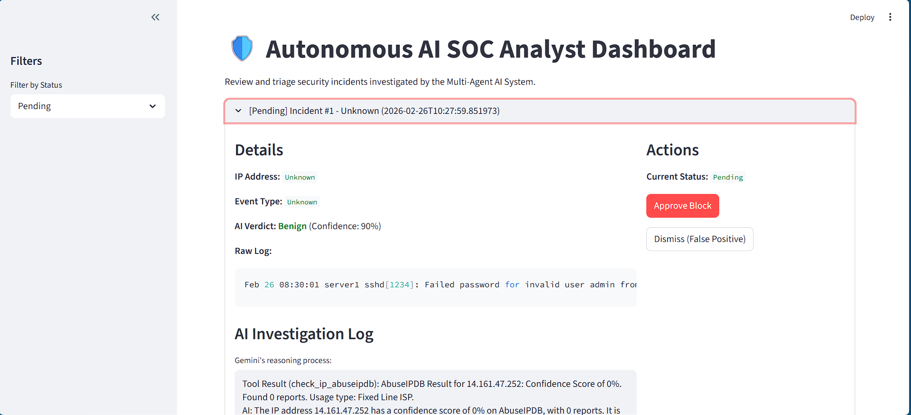

# 🛡️ Autonomous AI SOC Analyst



## 📌 Overview
The **Autonomous AI SOC Analyst** is an agentic AI pipeline designed to solve the "Alert Fatigue" problem in modern Security Operations Centers. It automates Tier-1 triage by ingesting raw system logs, parsing them locally for privacy, and performing intelligent cloud-based OSINT (Open-Source Intelligence) investigations to determine if a security event is a true threat.

## 🏗️ Architecture: The Hybrid Pipeline
This project uses a **Multi-Agent Orchestration** design that separates high-bandwidth local parsing from high-intelligence cloud reasoning.

### 1. Tier-0: The Local Parser (Privacy First)
- **Role**: Extracts entities (IPs, Hash, Usernames) from unstructured logs locally.
- **Engine**: `john-carter:latest` (via Ollama).
- **Why?**: Prevents sensitive PII (Personally Identifiable Information) from being sent to the cloud unnecessarily.

### 2. Tier-1: The Investigator (Cloud Intelligence)
- **Role**: An autonomous agent that decides which security tools to use based on indicators.
- **Engine**: **Gemini 2.0 Flash** + **LangGraph**.
- **Tools**: VirusTotal (File/Hash reputation) and AbuseIPDB (IP reputation/abuse history).

### 3. Tier-2: The Human-in-the-loop Dashboard
- **Role**: Aggregates AI findings into a "Case File."
- **Action**: A human analyst reviews the evidence and clicks "Approve Block" or "Dismiss."

## 🚀 Key Features
- **Real-time Log Triage**: Processes logs as they appear and identifies attack patterns (SSH Brute Force, SQL Injection, Path Traversal).
- **Agentic Reasoning**: The AI doesn't follow a rigid script; it chooses tools dynamically based on the log content.
- **Evidence-Backed Verdicts**: Every "Malicious" verdict comes with a detailed log of why (e.g., "IP flagged by 50+ vendors on VirusTotal").
- **Automatic Remediation**: Generates `iptables` or firewall commands to neutralize threats instantly.

## 🛠️ Tech Stack
- **Orchestration**: LangGraph
- **Cloud LLM**: Google Gemini 2.0 Flash
- **Local LLM**: Ollama (John-Carter / Gemma)
- **Database**: SQLite3
- **Frontend**: Streamlit
- **Environment**: Python 3.12+

## ⚙️ Installation & Setup

1. **Clone the Repo & Install Deps**:
   ```bash
   pip install -r requirements.txt
   ```

2. **Configure API Keys**:
   Create a `.env` file with:
   ```env
   GOOGLE_API_KEY="your_gemini_key"
   VT_API_KEY="your_virustotal_key"
   ABUSEIPDB_API_KEY="your_abuseipdb_key"
   ```

3. **Start Ollama**:
   Ensure you have a small model like `john-carter` or `gemma:2b` pulled.
   ```bash
   ollama run john-carter:latest
   ```

## 🎮 Usage

### Run the Simulation Pipeline
Ingest logs from `sample_auth.log` and trigger the AI investigation:
```bash
python run_pipeline.py
```

### Launch the Analyst Dashboard
Review cases and make final decisions:
```bash
streamlit run app.py
```

---
*Developed for future-ready Security Operations Centers.*